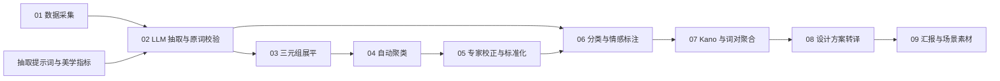

# 可视化流程与模块输入输出

本文面向数据可视化、前端和数据分析协作者，说明智能家居灯光 Feature–Perception 项目的模块边界、数据粒度、输入输出和推荐图表。机器可读版本见 [`pipeline-data-contract.json`](pipeline-data-contract.json)，设计素材索引见 [`../deliverables/assets/manifest.json`](../deliverables/assets/manifest.json)。

## 主流程



## 模块总表

| 模块 | 处理目标 | 主要输入 | 主要输出 | 输出粒度 |
| --- | --- | --- | --- | --- |
| 01 数据采集 | 汇集智能灯用户内容 | 公开平台帖子与链接 | `data/raw/smzdm-smart-light-posts.xlsx` | 一行一篇帖子，共 525 条数据行 |
| 02 LLM 抽取与校验 | 从分句中抽取场景、美学指标和感受，并检查是否保留原词 | 原始帖子、抽取提示词、美学指标体系 | `data/interim/extraction-with-validation.xlsx`；`valid-original-text-results.jsonl` | 一行一条分句抽取；JSONL 一行一篇有效原文 |
| 03 三元组展平 | 将嵌套 JSONL 拆成表格 | `valid-original-text-results.jsonl` | `valid-original-text-results-structured.xlsx` | 一行一个三元组，共 2,696 行 |
| 04 自动聚类 | 对三个语义维度生成候选簇 | 结构化三元组 | `valid-original-text-results-clustered.xlsx`（运行后生成） | 一行一个三元组，并增加 3 个聚类编号 |
| 05 专家校正 | 将候选簇转为业务可读标准标签 | 自动聚类结果、专家规则和美学指标体系 | `data/processed/expert-clustered.xlsx` | 一行一个三元组，共 2,696 行 |
| 06 分类与情感标注 | 给抽取记录补充标准场景、指标、感受和情感 | 抽取记录、专家标准标签 | `tagged-results.xlsx`；`tagged-results-with-sentiment.xlsx` | 一行一条有效标注，共 4,747 行 |
| 07 Kano 与词对聚合 | 按场景和词对计算频次、占比、情感率和 Kano 类型 | 完整标注表 | `analysis/kano-pair-statistics.xlsx` | 场景×指标、场景×指标×感受等聚合层级 |
| 08 设计方案转译 | 将高关注触点与 Kano 类型翻译为照明方案 | Kano 汇总、项目方案 | 场景效果图与灯光参数标注图 | 一张图对应一个场景或一个场景规格 |
| 09 汇报输出 | 串联洞察、方案和落地场景 | Kano 分析、设计素材 | `deliverables/natural-progressive-soft-light-system.pptx` | 6 页项目汇报 |

> 行数说明：Excel 的总行数包含表头，表中数据行数已扣除表头。不同模块的记录粒度不同，不能把 525、2,696、4,794 和 4,747 直接画成无损漏斗。

## 01 数据采集

输入是公开平台上的帖子或评论。当前标准输出字段为：

| 字段 | 含义 | 可视化用途 |
| --- | --- | --- |
| `序号` | 原始帖子序号 | 建议作为 `post_id` |
| `标题` | 帖子标题 | 搜索、详情页、主题词分析 |
| `作者` | 作者名称 | 仅在合规允许时用于去重，不建议公开展示 |
| `发布时间` | 来源页显示的发布时间 | 时间趋势；当前部分值可能缺少年份 |
| `正文内容` | 帖子正文 | 文本详情和抽取追溯 |
| `链接` | 来源 URL | 数据溯源 |

## 02 LLM 抽取与原词校验

核心输入：

- `docs/smart-lighting-extraction-prompt.docx`：抽取规则和输出格式。
- `docs/aesthetic-indicators.docx`：美学指标定义与同义表达。
- `data/raw/smzdm-smart-light-posts.xlsx`：原始语料。

`extraction-with-validation.xlsx` 的输出字段：

| 字段 | 角色 |
| --- | --- |
| `原句 (未分句)` | 原始上下文 |
| `分句 (模型输入)` | 模型实际处理文本，也是本表的数据粒度 |
| `使用场景` | 模型提取的原始场景词 |
| `标准美学指标` | 模型提取的原始指标词 |
| `用户感受` | 模型提取的原始感受词 |
| `是否为原词提取` | 原词校验结果 |
| `篡改/编造的词汇` | 校验失败原因 |
| `提取结果_完整JSON` | 完整结构化结果，适合详情展开 |

JSONL 输出以原文为粒度，`merged_triples` 是数组。每个元素包含 `usage_scenario`、`aesthetic_indicator` 和 `user_perceptions`。

## 03 三元组展平

`src/format_extraction_results.py` 将 JSONL 中的数组展开为四列：

```text
original_full_text
usage_scenario
aesthetic_indicator
user_perceptions
```

`user_perceptions` 在表格中可能以换行符连接多个感受。做 Sankey、词对统计或词云前，应先拆成“一行一个感受”，同时保留原三元组编号。

## 04 自动聚类

`src/cluster_structured_text.py` 分别对 `usage_scenario`、`aesthetic_indicator`、`user_perceptions` 做字符级 TF-IDF、SVD 降维和 HDBSCAN 聚类。

输出主表增加：

- `usage_scenario_cluster`
- `aesthetic_indicator_cluster`
- `user_perceptions_cluster`

同时生成 `cluster_summary` 和 `meta` 工作表。自动聚类编号只表示同一轮运行内的候选簇，不应直接作为面向用户的标签或颜色编码；重新运行后编号可能变化。

## 05 专家校正与标准化

`expert-clustered.xlsx` 的 `Data Clusters (Corrected)` 工作表保留原始三元组，并把三个聚类列替换为业务语义标签。其余工作表记录重分类说明、使用场景汇总和用户感受汇总。

可视化时应同时保留两层值：

- 原始层：`usage_scenario`、`aesthetic_indicator`、`user_perceptions`，用于证据和例句。
- 标准层：三个 `*_cluster` 字段，用于分组、筛选、图例和跨图联动。

## 06 分类与情感标注

完整输出字段为：

```text
原句 (未分句)
分句 (模型输入)
使用场景
标准美学指标
用户感受
使用场景分类
标准美学指标分类
用户感受分类
情感强度
```

仪表盘应优先使用 `tagged-results-with-sentiment.xlsx`。`tagged-results.xlsx` 可作为标注过程版本，不建议与完整版本混合统计。

## 07 Kano 与词对聚合

`kano-pair-statistics.xlsx` 是可视化的首选数据源：

- `Kano汇总`：场景×指标层级，含频次、场景内占比、情感计数/比例、主要感受、Kano 分类和设计优先级。
- `词对明细`：场景×指标×用户感受层级，适合 Sankey、网络图和词对排行。
- `全局统计`：场景、指标、感受和情感的全局分布。
- `Kano_场景名`：六个正式场景的详细触点分析。
- `方法说明`：Kano 分类定义、触点类型映射和样本不足规则。

当前 Kano 定义：A 为魅力型，O 为期望型，M 为基础型/风险项，I 为无差异型；单场景内指标提及少于 5 条标记为样本不足。场景分类“无”参与全局统计和词对明细，但不生成正式场景页。

## 08–09 设计转译与交付

设计素材按场景和用途成对组织：

| 场景 | 效果图 | 参数标注图 |
| --- | --- | --- |
| 日常基础照明 / 客厅 | `living-room-render.png` | `living-room-lighting-spec.png` |
| 休闲娱乐 / 客厅观影 | `living-room-entertainment-render.png` | `living-room-entertainment-lighting-spec.png` |
| 睡眠与起居 / 卧室 | `bedroom-render.png` | `bedroom-lighting-spec.jpg` |
| 亲子互动陪伴 / 亲子卧室 | `family-bedroom-render.png` | `family-bedroom-lighting-spec.png` |

可视化界面可以把 Kano 触点作为上游证据，把对应场景图作为下游方案：点击某个“场景×指标”后，展示频次、正负向率、主要感受、Kano 类型、设计建议及对应素材。

## 推荐的可视化视图

| 视图 | 数据源 | 维度 | 指标 | 推荐图形 |
| --- | --- | --- | --- | --- |
| 数据处理概览 | 各模块元数据 | 模块 | 行数、有效数、输出数 | 流程图；不要把不同粒度误画成转化率 |
| 场景分布 | `全局统计` | 使用场景分类 | 提及频次、全局占比 | 排序条形图 |
| 场景触点矩阵 | `Kano汇总` | 场景、指标 | 提及频次或场景内占比 | 热力图 |
| 感知关系流 | `词对明细` | 场景→指标→感受 | 提及频次 | Sankey 图 |
| 情感结构 | `Kano汇总` 或标注明细 | 场景、指标 | 正向/中性/负向数 | 100% 堆叠条形图 |
| Kano 优先级 | `Kano汇总` | 指标、Kano 分类 | 正向率、负向率、频次 | 气泡散点图；分类来自现有字段，不要重新推断 |
| 原词证据 | 完整标注表 | 标准标签、原始文本 | 记录数 | 可筛选明细表 |
| 洞察到方案 | Kano 汇总、素材清单 | 场景、指标、素材角色 | 频次、优先级 | 主从详情视图或故事线 |

## 连接与建模规则

1. 当前数据没有贯穿全流程的稳定主键。新建可视化数据层时，应增加 `post_id`、`segment_id`、`triple_id` 和 `tag_id`，并在每一步保留上游 ID。
2. 现有文件跨表追溯主要依赖原文文本。文本连接前要统一换行、空白和全半角字符，并检查重复值；不要默认原文唯一。
3. 原始词和标准分类必须分列保存。图表分组使用标准分类，证据详情显示原始词。
4. `无` 是业务分类值，空单元格才表示缺失。导入时不要把二者合并。
5. 百分比使用数值类型存储，前端负责格式化。不要把 `0.24` 提前转换成字符串 `24%`。
6. 图表默认从聚合表读取；只有例句、质量检查和钻取详情读取明细表。
7. 对外展示前应隐藏作者字段，并确认第三方用户内容和图片的使用权限。

## 建议的可视化数据模型

最小可用模型由一张事实表和四张维表组成：

```text
fact_tagged_pair
  tag_id, post_id, segment_id, scenario_id, indicator_id,
  perception_id, sentiment_id, original_text

dim_scenario
dim_indicator（包含 touchpoint_type）
dim_perception
dim_sentiment
```

Kano 结果可作为 `agg_kano_scenario_indicator` 和 `agg_pair_detail` 两张聚合表。设计素材通过 `scene_key` 与 `dim_scenario` 连接，避免把图片路径直接写入事实表。
