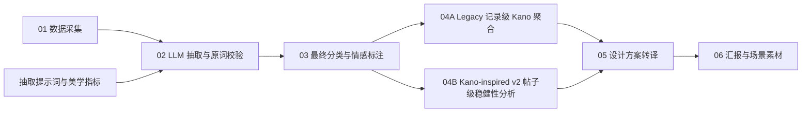

# 可视化流程与模块输入输出

本文面向数据可视化、前端和数据分析协作者，说明智能家居灯光 Feature–Perception 项目的模块边界、数据粒度、输入输出和推荐图表。机器可读版本见 [`pipeline-data-contract.json`](pipeline-data-contract.json)，设计素材索引见 [`../deliverables/assets/manifest.json`](../deliverables/assets/manifest.json)。

## 主流程



## 模块总表

| 模块 | 处理目标 | 主要输入 | 主要输出 | 输出粒度 |
| --- | --- | --- | --- | --- |
| 01 数据采集 | 汇集智能灯用户内容 | 公开平台帖子与链接 | `data/raw/smzdm-smart-light-posts.xlsx` | 一行一篇帖子，共 525 条数据行 |
| 02 LLM 抽取与校验 | 从分句中抽取场景、美学指标和感受，并检查是否保留原词 | 原始帖子、抽取提示词、美学指标体系 | `data/interim/extraction-with-validation.xlsx` | 一行一条分句抽取，共 4,794 条数据行 |
| 03 最终分类与情感标注 | 为有效抽取记录补充正式分类和情感 | 通过校验的抽取记录、分类规则 | `data/processed/tagged-results-with-sentiment.xlsx` | 一行一条最终标注，共 4,747 条数据行 |
| 04A Legacy Kano 与词对聚合 | 按抽取记录计算频次、占比、情感率并保留原有 Kano 映射 | 最终标注表 | `analysis/kano-pair-statistics.xlsx` | 记录级场景×指标、场景×指标×感受等聚合层级 |
| 04B Kano-inspired v2 | 同帖去重后计算帖子票、公开阈值、置信区间和分类稳定率 | 最终标注表、v2 配置 | `outputs/kano_v2/kano-inspired-v2.xlsx` | 帖子级场景×指标、场景×指标×感受及稳定性结果 |
| 05 设计方案转译 | 将高关注触点与 Kano 类型转化为照明方案 | Kano 汇总、项目方案 | `deliverables/assets/manifest.json` 及场景素材 | 一张图对应一个场景或一个场景规格 |
| 06 汇报输出 | 串联洞察、方案和落地场景 | Kano 分析、设计素材 | `deliverables/natural-progressive-soft-light-system.pptx` | 6 页项目汇报 |

> 行数说明：Excel 的总行数包含表头，表中数据行数已扣除表头。不同模块的记录粒度不同，不能把 525、4,794 和 4,747 直接解释为无损转化率。

## 01 数据采集

输入是公开平台上的帖子或评论。标准输出字段为：

| 字段 | 含义 | 可视化用途 |
| --- | --- | --- |
| `序号` | 原始帖子序号 | 建议作为 `post_id` |
| `标题` | 帖子标题 | 搜索、详情页、主题词分析 |
| `作者` | 作者名称 | 仅在合规允许时用于去重，不建议公开展示 |
| `发布时间` | 来源页显示的发布时间 | 时间趋势；当前部分值可能缺少年份 |
| `正文内容` | 帖子正文 | 文本详情和抽取追溯 |
| `链接` | 来源 URL | 数据溯源 |

## 02 LLM 抽取与原词校验

核心输入：

- `docs/smart-lighting-extraction-prompt.docx`：抽取规则和输出格式。
- `docs/aesthetic-indicators.docx`：美学指标定义与同义表达。
- `data/raw/smzdm-smart-light-posts.xlsx`：原始语料。

`extraction-with-validation.xlsx` 的输出字段：

| 字段 | 角色 |
| --- | --- |
| `原句 (未分句)` | 原始上下文 |
| `分句 (模型输入)` | 模型实际处理文本，也是本表的数据粒度 |
| `使用场景` | 模型提取的原始场景词 |
| `标准美学指标` | 模型提取的原始指标词 |
| `用户感受` | 模型提取的原始感受词 |
| `是否为原词提取` | 原词校验结果 |
| `篡改/编造的词汇` | 校验失败原因 |
| `提取结果_完整JSON` | 完整结构化结果，适合详情展开 |

`valid-original-text-results.jsonl` 保留以原文为粒度的嵌套抽取结果，可用于质量抽查。`merged_triples` 中的元素包含 `usage_scenario`、`aesthetic_indicator` 和 `user_perceptions`。运行 `src/format_extraction_results.py` 可以生成便于查看的四列表格，但该表不参与最终统计。

## 03 最终分类与情感标注

正式数据源是 `data/processed/tagged-results-with-sentiment.xlsx`，字段为：

```text
原句 (未分句)
分句 (模型输入)
使用场景
标准美学指标
用户感受
使用场景分类
标准美学指标分类
用户感受分类
情感强度
```

可视化时应保留两层信息：

- 原始层：`使用场景`、`标准美学指标`、`用户感受`，用于例句、证据和钻取详情。
- 分类层：`使用场景分类`、`标准美学指标分类`、`用户感受分类`、`情感强度`，用于分组、筛选、图例和聚合。

正式分类包括：

- 使用场景：日常基础照明、睡眠与起居、学习工作、智能托管、休闲娱乐、亲子互动陪伴、无。
- 美学指标：照明与色调、交互功能、风格设计、形体造型、视觉舒适、做工细节、材料质感、空间氛围、色彩。
- 用户感受：美观与价值感、舒适感、便捷性、愉悦与氛围感、安全感、专注、无。
- 情感强度：正向、中性、负向。

## 04 Kano 与词对聚合

本项目保留两套互补口径，不相互覆盖：

- **Legacy 记录级结果**：保留现有项目成果与设计转译口径，作为默认展示结果。
- **Kano-inspired v2 帖子级结果**：控制长帖重复贡献，提供显式阈值、Bootstrap 置信区间和稳定性标记，用于方法升级、稳健性检查和答辩说明。

两者都从 `data/processed/tagged-results-with-sentiment.xlsx` 开始，不要求重新运行上游 LLM 抽取、聚类或人工分类。

`kano-pair-statistics.xlsx` 是可视化的首选聚合数据源：

- `Kano汇总`：场景×指标层级，含频次、场景内占比、情感计数/比例、主要感受、Kano 分类和设计优先级。
- `词对明细`：场景×指标×用户感受层级，适合 Sankey、网络图和词对排行。
- `全局统计`：场景、指标、感受和情感的全局分布。
- `Kano_场景名`：六个正式场景的详细触点分析。
- `方法说明`：Kano 分类定义、触点类型映射和样本不足规则。

当前 Kano 定义：A 为魅力型，O 为期望型，M 为基础型/风险项，I 为无差异型；单场景内指标提及少于 5 条标记为样本不足。场景分类“无”参与全局统计和词对明细，但不生成正式场景页。

`outputs/kano_v2/kano-inspired-v2.xlsx` 是帖子级稳健性数据源：

- `场景汇总_帖子级`：一篇帖子对同一“场景×指标”只贡献一票，含公开分类阈值、95% 置信区间和分类稳定率。
- `词对明细_帖子级`：场景×指标×感受的帖子级聚合。
- `Bootstrap稳定性`：展示区间宽度、Bootstrap 众数分类和质量标记。
- `Legacy对照`：说明两种统计单位和分类规则造成的差异，不把差异解释为原结果错误。
- `帖子级投票`：保留去重、冲突处理和来源行，供审计与钻取。

v2 的正式名称是“基于 UGC 情感分布的 Kano-inspired 需求优先级分析”，不等同于经典 Kano 正反问题问卷。

## 05–06 设计转译与交付

设计素材按场景和用途成对组织：

| 场景 | 效果图 | 参数标注图 |
| --- | --- | --- |
| 日常基础照明 / 客厅 | `living-room-render.png` | `living-room-lighting-spec.png` |
| 休闲娱乐 / 客厅观影 | `living-room-entertainment-render.png` | `living-room-entertainment-lighting-spec.png` |
| 睡眠与起居 / 卧室 | `bedroom-render.png` | `bedroom-lighting-spec.jpg` |
| 亲子互动陪伴 / 亲子卧室 | `family-bedroom-render.png` | `family-bedroom-lighting-spec.png` |

可视化界面可以把 Kano 触点作为上游证据，把对应场景图作为下游方案：点击某个“场景×指标”后，展示频次、正负向率、主要感受、Kano 类型、设计建议及对应素材。

## 推荐的可视化视图

| 视图 | 数据源 | 维度 | 指标 | 推荐图形 |
| --- | --- | --- | --- | --- |
| 数据处理概览 | 各模块元数据 | 模块 | 行数、有效数、输出数 | 流程图；不要把不同粒度误画成转化率 |
| 场景分布 | `全局统计` | 使用场景分类 | 提及频次、全局占比 | 排序条形图 |
| 场景触点矩阵 | `Kano汇总` | 场景、指标 | 提及频次或场景内占比 | 热力图 |
| 感知关系流 | `词对明细` | 场景→指标→感受 | 提及频次 | Sankey 图 |
| 情感结构 | `Kano汇总` 或最终标注明细 | 场景、指标 | 正向/中性/负向数 | 100% 堆叠条形图 |
| Kano 优先级 | `Kano汇总` | 指标、Kano 分类 | 正向率、负向率、频次 | 气泡散点图；分类来自现有字段，不要重新推断 |
| Legacy/v2 对照 | `Legacy对照` | 场景、指标、两种分类 | 记录数、帖子数、分类变化 | 哑铃图或并列表；用于解释口径变化 |
| v2 稳定性 | `Bootstrap稳定性` | 场景、指标、v2 分类 | 分类稳定率、置信区间宽度 | 排序点图或误差线图 |
| 原词证据 | 最终标注表 | 正式分类、原始文本 | 记录数 | 可筛选明细表 |
| 洞察到方案 | Kano 汇总、素材清单 | 场景、指标、素材角色 | 频次、优先级 | 主从详情视图或故事线 |

## 连接与建模规则

1. 当前数据没有贯穿全流程的稳定主键。新建可视化数据层时，应增加 `post_id`、`segment_id` 和 `tag_id`，并在每一步保留上游 ID。
2. 现有文件跨表追溯主要依赖原文文本。文本连接前要统一换行、空白和全半角字符，并检查重复值；不要默认原文唯一。
3. 原始词和正式分类必须分列保存。图表分组使用正式分类，证据详情显示原始词。
4. `无` 是业务分类值，空单元格才表示缺失。导入时不要把二者合并。
5. 百分比使用数值类型存储，前端负责格式化。不要把 `0.24` 提前转换成字符串 `24%`。
6. 图表默认从聚合表读取；只有例句、质量检查和钻取详情读取最终标注明细。
7. 对外展示前应隐藏作者字段，并确认第三方用户内容和图片的使用权限。
8. Legacy 与 v2 必须显示统计口径标签，不得把记录数与帖子票直接混在同一分母中。
9. 默认项目成果展示使用 Legacy；方法升级与稳健性视图使用 v2。切换口径时同步更新频次、比例、分类和说明文字。

## 建议的可视化数据模型

最小可用模型由一张事实表和四张维表组成：

```text
fact_tagged_pair
  tag_id, post_id, segment_id, scenario_id, indicator_id,
  perception_id, sentiment_id, original_text

dim_scenario
dim_indicator（包含 touchpoint_type）
dim_perception
dim_sentiment
```

Kano 结果可分别建模为 `agg_kano_legacy`、`agg_kano_v2` 和 `agg_pair_detail`。公共字段使用 `scene_id` 与 `indicator_id` 连接，并增加 `analysis_mode` 标识 `legacy_record` 或 `v2_post`。设计素材通过 `scene_key` 与 `dim_scenario` 连接，避免把图片路径直接写入事实表。
